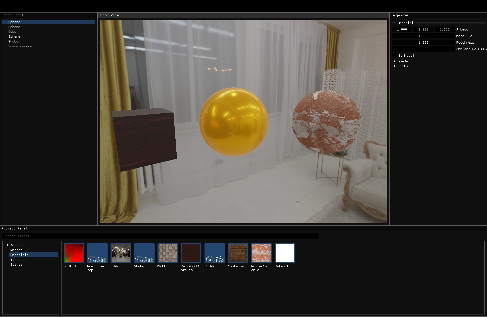

## Welcome to Zeus!

This is a WIP rendering engine project in OpenGL (Vulkan coming soon) and C++ that may eventually become a game engine.

## Features

ENTT ECS integration,
Lighting,
A simple editor,
Component manipulation,
API independent rendering

## Features to add

Event System,
Keyboard scene camera movement,
Vulkan support,
Mesh Loading,
Compute Ray Tracing,
User-defined components,
Scripting,
Physics bodies,
And more..

## Building

git clone --recurse-submodules https://github.com/Metinis/ProjectZeus.git
